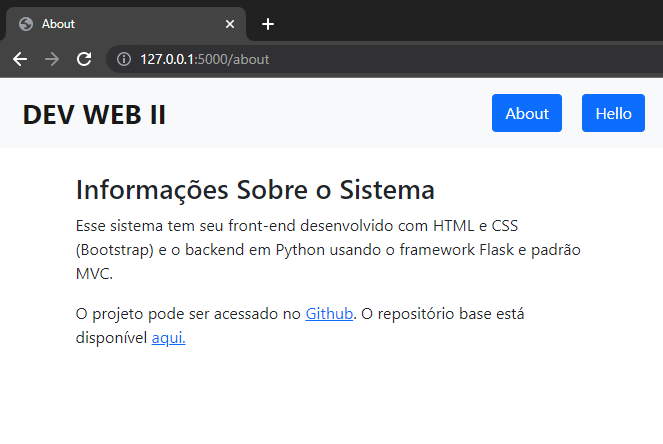

<!-- Justifica o texto (em sistemas que suportam) -->
<!-- <style>body {text-align: justify}</style> -->
# DESENVOLVIMENTO WEB II
**2021.2 - IFPR Foz**

---

## CONTEÚDO

- [DESENVOLVIMENTO WEB II](#desenvolvimento-web-ii)
  - [CONTEÚDO](#conteúdo)
  - [Preparação do Ambiente](#preparação-do-ambiente)
    - [Python e Pip](#python-e-pip)
    - [Pycharm](#pycharm)
    - [Git](#git)
    - [SQLite](#sqlite)
    - [SQLite Browser](#sqlite-browser)
  - [20220125 - Aula 1 - Introdução](#20220125---aula-1---introdução)
    - [Atividade 2](#atividade-2)
  - [20220208 - Projetinho do sorteador](#20220208---projetinho-do-sorteador)
  - [20220115 - Padronização de projeto e Boas práticas](#20220115---padronização-de-projeto-e-boas-práticas)
  - [Venv Python](#venv-python)
  - [20220222 - anotações](#20220222---anotações)

---
## Preparação do Ambiente
*Atividade assíncrona referente as aulas de 21 e 28/12/2021*

**Observação: os passos a seguir foram no sistema operacional Ubuntu**

Instalar, configurar e estudar as ferramentas a seguir:

### Python e Pip

Python é uma linguagem de programação de alto nível, usaremos ela nessa disciplina, para isso é necessário **instalar o interpretador** na máquina, no caso do **Ubuntu**, basta executar o comando a seguir:

`$ sudo apt-get install python3`

Para programar os sistemas dessa disciplina será necessária a instalação de pacotes ou bibliotecas de códigos, para isso usaremos o gerenciador de pacotes **Pip**, use o comando a seguir para instalar:

`$ sudo apt-get install python3-pip`

Foi instalado o *Python 3.9* e o *Pip 21.2*.

### Pycharm

Podemos escrever programas em Python até com o bloco de Notas, mas essa tarefa se torna complexa de gerenciar conforme o sistema vai crescendo, portanto usaremos **Pycharm**, uma IDE (ambiente integrado de desenvolvimento), que trás várias ferramentas para agilizar a programação. Comando para instalar:

`$ sudo apt-get install pycharm`

Foi instalada a versão *2021.3.1*.

### Git

A ferramente **Git** serve para controle e gerenciamento de versão de códigos dos sistemas que serão desenvolvidos, permitindo fazer um versionamento sem precisar ficar renomeando e copiando arquivos. Comando para instalar:

`$ sudo apt-get install git`

Foi instalada a versão *2.35.0*.

### SQLite

Nos projetos precisaremos de um banco de dados, o mais simples e prático para começar a praticar SQL é o SQLite, que consiste de uma biblioteca em C que implementa um banco de dados SQL em arquivo, os programas em Python poderão acessar o banco de dados sem a necessidade de executar um SGBD (sistema gerenciador de banco de dados). Comando para instalar:

`$ sudo apt-get install sqlite3`

Foi instalada a versão *3.31.1*.

### SQLite Browser

Essa ferramenta serve facilitar o acesso ao banco de dados, oferecendo interface gráfica onde o usuário pode criar, projetar e editar arquivos de banco de dados SQLite. Comando para instalar:

`$ sudo apt-get install sqlitebrowser`

Foi instalada a versão *3.12.2*.

---

## 20220125 - Aula 1 - Introdução
**Notas de Aula**

Nesta disciplina vamos focar mais em programar o lado do servidor (server-side), diferente da programação no lado do cliente, onde usamos o JavaScript, no servidor tem uma ampla gama de linguagens que podem ser utilizadas como, por exemplo, Java, Python, PHP, C# (.NET), etc. Nessa disciplina serão implementados sistemas com **Python**.

**Servidor**: serviço que é executado, geralmente com protocolo HTTP, como o Apache, e fica escutando e aguardando requisições numa porta (80), recebe e responde as requisições. Exemplo de endereço e requisição:

`https://localhost:80/url/obter/id/...`

No nosso caso o servidor será o framework **Flask** (Python).

Mas para testar o que faremos no servidor, precisaremos usar o JavaScript no lado do cliente para enviar requisições para o servidor (Flask). Request, response (HTTP). Entenderemos como o JS envia as requisições, iniciaremos com chamadas síncronas, se der tempo veremos também as assíncronas (mais legal).

**Objetivo e necessidade da programação no lado do servidor**: a persistência de dados, banco de dados, sigilo de informação, execução de tarefas complexas e que no lado do cliente não seriam possíveis.

### Atividade 2

Executar os comandos a seguir no terminal:

```
git clone https://github.com/fscheidt/flask_basic.git

cd flask_basic

python3 -m venv venv

source venv/bin/activate

pip3 install -r ./requirements.txt
```

Após clonar o projeto, implementar uma rota `"/about"` que redireciona para `about.html` com informações sobre o sistema. Enviar projeto para o professor em arquivo zip ou link no github.

[Diretório com a atividade](/flask_basic/)


## 20220208 - Projetinho do sorteador

Disponível em: ...

## 20220115 - Padronização de projeto e Boas práticas

Referência: [Python/Flask Tutorial for Visual Studio Code](https://github.com/microsoft/python-sample-vscode-flask-tutorial)

python --version


```
# no diretorio do projeto
source venv/bin/activate

pip3 install -r ./requirements.txt
```


## Venv Python

```
# Creates the virtual env
python3 -m venv <folder-name>

# Activate
source <folder-name>/bin/activate

# Install requirements
pip3 install -r ./requirements.txt

```
## 20220222 - anotações
`manter/database.py`: gerencia a conexão com o banco de dados
`manter/dao.py`: tem as funções de CRUD, gerenciamento dos dados